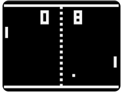

# Pong Game

Este é um simples jogo Pong desenvolvido em Python usando a biblioteca Pygame.

## Requisitos

- Python 3.x
- Pygame

## Instalação

1. Clone este repositório:

```bash
git clone https://github.com/seu-usuario/pong-game.git
cd pong-game
```

2. Crie um ambiente virtual (opcional, mas recomendado):

```bash
python -m venv venv
source venv/bin/activate  # No Windows, use `venv\Scripts\activate`
```

3. Instale as dependências:

```bash
pip install -r requirements.txt
```

# Executando o Jogo
Para iniciar o jogo, execute o seguinte comando:
```bash
python pong.py
```

# Controles
- Jogador 1:
    - W para mover para cima
    - S para mover para baixo

- Jogador 2:
    - Seta para cima para mover para cima
    - Seta para baixo para mover para baixo

# Estrutura do Projeto
- pong.py: Contém o código-fonte do jogo Pong.
- requirements.txt: Lista de dependências necessárias para executar o projeto.
- README.md: Arquivo com instruções de configuração e execução

# Captura de Tela


# Licença
Este projeto está licenciado sob a licença MIT. 